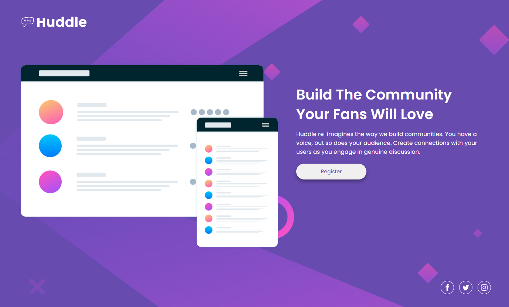

# Frontend Mentor - Huddle landing page with single introductory section solution

This is a solution to the [Huddle landing page with single introductory section challenge on Frontend Mentor](https://www.frontendmentor.io/challenges/huddle-landing-page-with-a-single-introductory-section-B_2Wvxgi0). Frontend Mentor challenges help you improve your coding skills by building realistic projects. 

## Table of contents

- [Overview](#overview)
  - [The challenge](#the-challenge)
  - [Screenshot](#screenshot)
  - [Links](#links)
- [My process](#my-process)
  - [Built with](#built-with)
  - [What I learned](#what-i-learned)
- [Author](#author)

## Overview
- A responsive landing page built with HTML and CSS (Flexbox)

### The challenge
- Build out this landing page and get it looking as close to the design as possible.

### Screenshot

### Links
- Live Site URL: 

## My process
- Utilized *flexbox* on the **body** element to horizontally center the flex-items (header, main, footer), as well as equally separate those items vertically
- Used a *container* class to set the max-width of the flex-items
- Utilized various *flexbox* properties to achieve the desired responsiveness and to match the design spec
- Used a mobile-first approach to writing CSS
 

### Built with
- Semantic HTML5 markup
- CSS custom properties
- CSS Flexbox
- Mobile-first approach to CSS

### What I learned
- How to work with CSS flexbox properties for a full-screen landing page; specifically, how to horizontally and vertically space out the different key areas of the landing page
- Continued practice with writing mobile-first CSS
- Adjusting CSS flexbox properties for desktop vs mobile layouts

## Author
- Ryan Hemrick